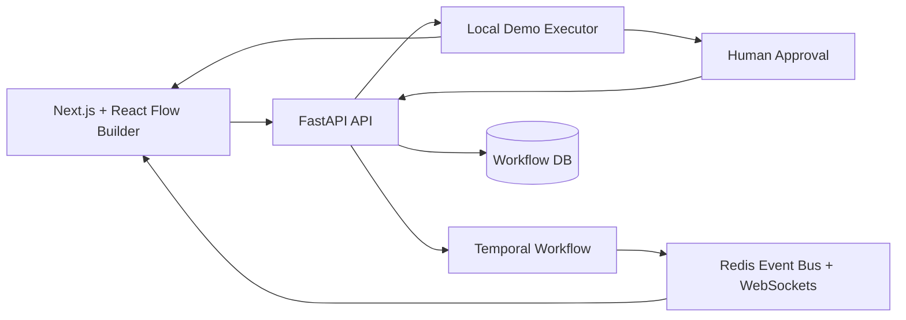

# SyncFlow: Durable AI Workflow Builder for Approval-Critical Enterprise Workflows

This project is a proof-of-work for the AI workflow builder category. It is not
a VectorShift clone. It explores the reliability layer underneath visual AI
workflow tools: local demo execution, durable orchestration, human approval,
eval gates, cost visibility, and audit-ready run history.

The flagship demo is a private-market diligence workflow:

1. Paste investment memo or diligence notes.
2. Extract material claims, risks, and assumptions.
3. Run an eval gate for completeness and confidence.
4. Pause for human approval.
5. Generate an IC memo section.
6. Show final output with audit, cost, latency, and approval metadata.

## Screenshots

### Dashboard


### Operator Builder


### Completed Run Report


## Why This Exists

Visual AI builders make it easy to connect nodes. The hard part starts after the
first demo: teams need to know what happened, who approved it, what failed, how
much it cost, and whether the workflow can survive long-running business
processes.

This repo focuses on that trust layer:

- **Local Demo Mode:** reviewers can run the flagship workflow without Temporal,
  Redis, OpenAI, Docker, or cloud credentials.
- **Temporal Mode:** the production path still uses Temporal for durable,
  long-running workflow execution.
- **Human Approval:** workflows can pause for review and resume with an audit
  trail.
- **Eval Gates:** model outputs can be scored before downstream actions run.
- **Execution Timeline:** every node event is visible in the UI.
- **Cost and Latency Metadata:** demo outputs include model, token, cost, and
  latency fields.

## Quick Start

### Frontend

```bash
cd frontend
npm install
npm run dev
```

Open `http://localhost:3000`.

### Backend

For the reviewer-friendly local demo:

```bash
cd backend
python -m venv .venv
.venv\Scripts\activate
pip install -r requirements-dev.txt
$env:PYTHONIOENCODING="utf-8"
$env:EXECUTION_BACKEND="local"
uvicorn app.main:app --reload --port 8000
```

`EXECUTION_BACKEND=local` is the default. It uses SQLite defaults and
deterministic local outputs, so no external services are required.

For the production-style Temporal path:

```bash
$env:EXECUTION_BACKEND="temporal"
$env:DATABASE_URL="<postgres-url>"
$env:REDIS_URL="<redis-url>"
$env:TEMPORAL_HOST="<temporal-host>"
$env:TEMPORAL_NAMESPACE="<temporal-namespace>"
$env:OPENAI_API_KEY="<openai-key>"
uvicorn app.main:app --reload --port 8000
```

## Demo Walkthrough

1. Open the dashboard.
2. Choose **Private Market Diligence Review**.
3. Click **Run**.
4. Watch the timeline update as nodes start and complete.
5. Review the Partner Review approval modal.
6. Approve the risk framing.
7. Inspect the generated IC memo and audit metrics.

The demo should be explainable in 60-90 seconds:

> This is an AI workflow builder focused on trust. It can run locally for easy
> review, but the production path keeps Temporal for durable execution. The demo
> extracts diligence risks, runs an eval, pauses for human approval, and generates
> an IC memo with audit, cost, and latency metadata.

## Application Blurb

I had an older AI orchestration prototype and rebuilt it around a question that
matters for AI workflow builders: once users can visually build workflows, how
do you make those workflows trustworthy enough for enterprise work? This version
adds local demo execution, Temporal-backed production architecture, human
approval, eval gates, and audit/cost/latency visibility around a private-market
diligence workflow.

## Architecture



Local mode and Temporal mode share the same workflow definition shape. The
execution backend changes, not the builder model.

## Technical Documentation

Current reviewer-facing docs live in [`docs/`](docs/README.md):

- [Architecture](docs/architecture.md): execution modes, approval flow, frontend state, and trade-offs.
- [Local Demo Runbook](docs/local-demo-runbook.md): exact setup, run steps, QA commands, and troubleshooting.
- [API And Events Reference](docs/api-and-events.md): endpoints, response shapes, event names, and node semantics.
- [Demo Script](docs/demo-script.md): 60-90 second walkthrough and application positioning.

## API Surface

`POST /api/workflows/{workflow_id}/execute`

Base response:

```json
{
  "execution_id": "...",
  "workflow_id": "...",
  "status": "running",
  "execution_backend": "temporal"
}
```

Local mode may also return:

```json
{
  "execution_backend": "local",
  "events": [],
  "output": {},
  "pending_approval": {}
}
```

`POST /api/approvals/{execution_id}/approve`

Local mode may return continuation events and final output:

```json
{
  "status": "approved",
  "execution_status": "completed",
  "execution_backend": "local",
  "events": [],
  "output": {}
}
```

## Quality Gates

Current verification:

```bash
cd backend
.venv\Scripts\python.exe -m pytest

cd frontend
npm run test
npm run lint
npm run build
```

Expected result:

- Backend unit/API tests pass.
- E2E test remains skipped unless `RUN_E2E=1`.
- Frontend event/name tests pass.
- Frontend lint has no warnings.
- Frontend production build succeeds.

If `npm run build` runs while `npm run dev` is already serving the app, restart
the dev server before browser testing. Next.js can otherwise keep serving stale
development chunk paths from `.next`.

On Windows, keep `$env:PYTHONIOENCODING="utf-8"` set for background backend
runs. This prevents terminal encoding issues from interrupting startup logs.

## What I Intentionally Did Not Build In 2 Days

- Full marketplace.
- RBAC and auth.
- Real VDR ingestion.
- Real document parsing.
- External connectors.
- Multi-tenant production hardening.
- Plugin ecosystem.
- Knowledge-to-workflow compiler.

Those would make sense after the local trust-layer demo is sharp.

## What I Would Build Next At VectorShift Scale

1. Source-grounded document ingestion with citations.
2. Eval suites for workflow templates.
3. Workflow versioning and diff review.
4. Approval policies by role and risk level.
5. Replayable execution history for debugging.
6. Cost and latency budgets per workflow.
7. Template analytics: where users edit, fail, and abandon workflows.

## Tech Stack

- Frontend: Next.js, React, TypeScript, Tailwind, React Flow, Zustand.
- Backend: FastAPI, SQLAlchemy, Temporal, Redis, PostgreSQL/SQLite.
- AI path: deterministic local demo executor plus production model providers.

## License

Copyright 2025 Sandip Pathe. For evaluation and demonstration only.
