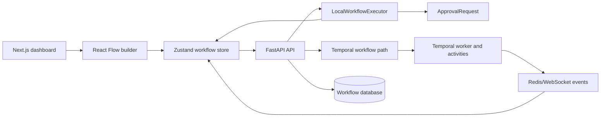
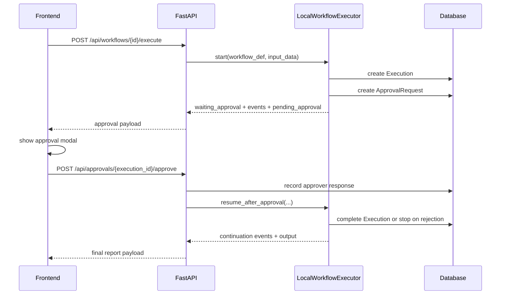

# SyncFlow Architecture

SyncFlow is a proof-of-work for the trust layer under visual AI workflow
builders. The product question is not "can a user draw nodes?" It is "can the
team trust what ran, who approved it, what it cost, and what should happen when
the run waits on a human?"

## System Shape

The workflow definition shape stays the same in both execution modes. The
backend setting `EXECUTION_BACKEND=local|temporal` controls how execution runs.

## Execution Modes

### Local Demo Mode

Local mode is the default. It exists so a reviewer can run the flagship demo
without Temporal, Redis, OpenAI, Docker, or cloud credentials.

The local runner:

1. Creates an `Execution` row.
2. Validates the workflow definition.
3. Runs nodes in graph order.
4. Writes node outputs into `Execution.output_data`.
5. Creates an `ApprovalRequest` at approval nodes.
6. Returns frontend-ready events directly from the execute or approval API.
7. Builds a final report payload with memo output, approval decision, eval score,
   total cost, total latency, and node evidence.

Local mode is deterministic by design. It is honest demo infrastructure, not a
fake production LLM integration.

### Temporal Mode

Temporal mode is the production reliability path. The API starts the existing
Temporal workflow and returns the original async execution shape. Node events
continue through the Redis/WebSocket path.

The important split:

| Concern | Local mode | Temporal mode |
| --- | --- | --- |
| Start API | Returns events and pending approval directly | Starts Temporal workflow |
| Event delivery | Execute/approval responses | WebSocket stream |
| External services | None required for demo | Temporal and usually Redis |
| Model outputs | Deterministic local responses | Provider-backed activities |
| Use case | Review, hiring demo, local smoke test | Durable production-style orchestration |

## Frontend State Model

The frontend keeps one event application path:

1. Backend event is normalized in `frontend/lib/workflow-events.ts`.
2. Store appends the event.
3. Store maps the event to node status.
4. Approval events set approval state.
5. Final output opens the report surface and switches the inspector to completed
   mode.

This matters because local mode and Temporal mode do not drift in the UI. The
same node status rules handle `node.started`, `node.completed`,
`approval.requested`, `approval.granted`, `approval.denied`, and
`workflow.failed`.

Legacy approval event names are still accepted:

- `hitl.approval.requested`
- `ui.approval.requested`

The canonical event name is `approval.requested`.

## Approval Flow

The approval modal waits for the API call to succeed before closing. If the API
fails, the user still sees the modal and can retry.

Rejection is explicit. If a reject edge is not present, local mode marks the run
as failed/stopped instead of silently following the approval branch.

## Data Persistence

No schema migration was added for the proof-of-work. Local state uses existing
fields:

| Model | Field | Use |
| --- | --- | --- |
| `Workflow` | `definition` | Nodes and edges |
| `Execution` | `input_data` | Run input |
| `Execution` | `current_node` | Current local node or approval node |
| `Execution` | `output_data` | Local state while paused, final report after completion |
| `ApprovalRequest` | `approval_data` | Approval title, description, context, and responses |

## Operator UI

The builder is meant to feel like an operator tool:

- Compact nodes with status state.
- Small chips for cost, latency, and eval score.
- Left library grouped by core nodes and trust nodes.
- Toolbar with project name, backend badge, primary run action, and icon-only
  secondary actions.
- Right inspector that changes by mode:
  - Design mode: selected node config.
  - Run mode: execution timeline.
  - Completed mode: report summary, metrics, and approval decision.

## Trade-offs

- Local execution is explicit and deterministic instead of abstracted behind a
  new execution framework. That keeps the demo easy to inspect.
- Text-file upload is supported, but PDF and DOCX parsing are out of scope.
- Local mode returns events in HTTP responses, while Temporal uses WebSockets.
  The frontend normalization layer keeps the UI contract shared.
- The proof-of-work uses the existing database shape to avoid migration risk
  during a 2-day build.

## Main Files

| File | Responsibility |
| --- | --- |
| `backend/app/core/config.py` | App settings, including `EXECUTION_BACKEND` |
| `backend/app/api/workflows.py` | Workflow CRUD and execute endpoint |
| `backend/app/api/approvals.py` | Approval response endpoint |
| `backend/app/services/local_execution.py` | Deterministic local runner |
| `backend/app/services/templates.py` | Flagship diligence template |
| `frontend/lib/workflow-events.ts` | Event normalization and node status mapping |
| `frontend/lib/store.ts` | Workflow runtime state |
| `frontend/components/modals/run-input.tsx` | Local demo input/upload modal |
| `frontend/components/modals/approval.tsx` | Human approval modal |
| `frontend/components/modals/workflow-report.tsx` | Final report modal |
| `frontend/components/sidebar/properties.tsx` | Mode-aware right inspector |
