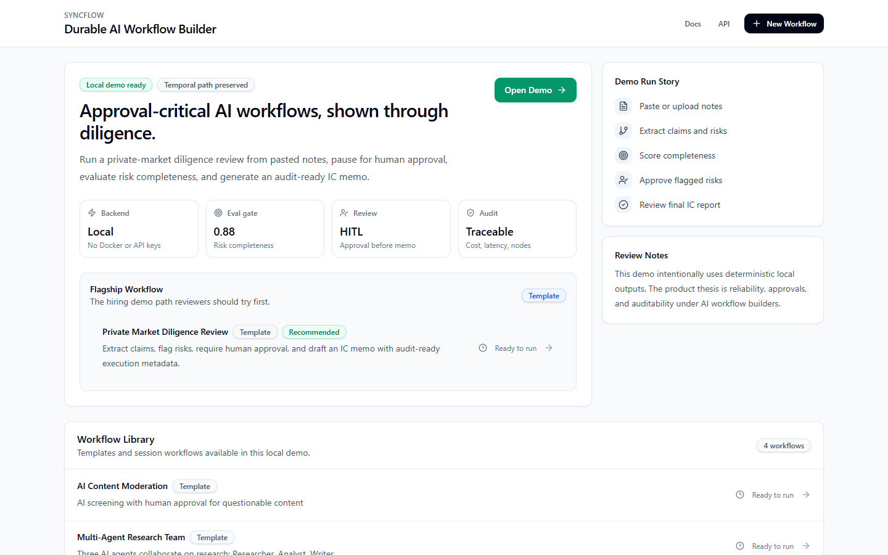
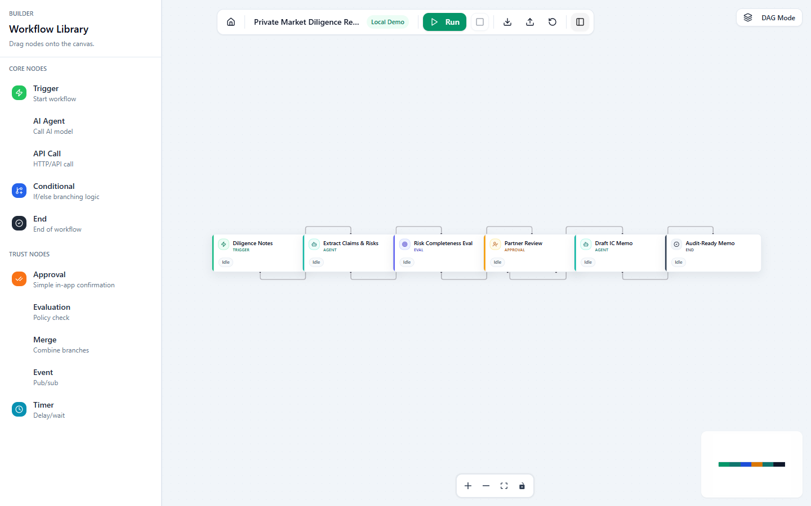
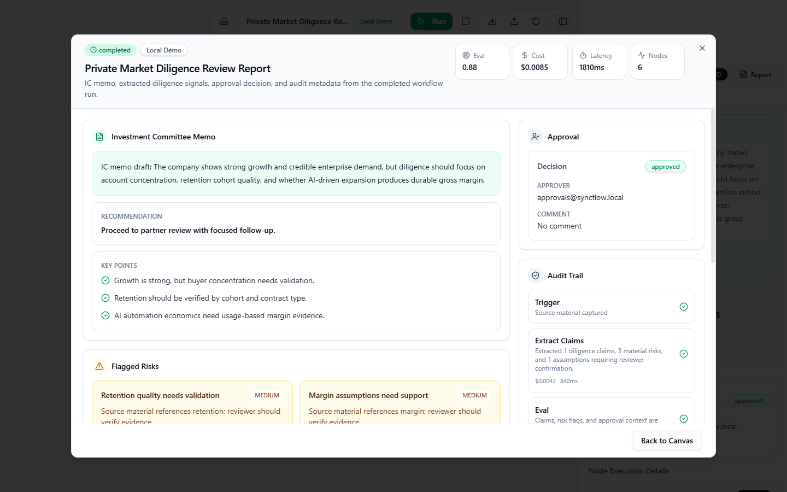

# SyncFlow Project Report

Author: Sandip Pathe
Date: June 16, 2026
Branch: `codex/syncflow-proof-of-work`
Pull request: `sandip-pathe/syncflow#1`

## Executive Summary

SyncFlow is a proof-of-work for the AI workflow builder category. The project
started as an older orchestration prototype and was reshaped into a focused
hiring artifact for VectorShift-style engineering review.

The core thesis is simple:

> Visual AI builders make workflow creation easy. The hard part is trust:
> durable execution, human approvals, eval gates, audit trails, local
> demoability, and operator clarity.

This is intentionally not a broad marketplace or a VectorShift clone. It is a
sharp exploration of the reliability layer underneath no-code AI workflow
builders.

## Final Product

The reviewer path is the `Private Market Diligence Review` workflow:

1. Paste diligence notes or upload a text-like file.
2. Extract key claims, risks, numbers, and assumptions.
3. Run an eval gate for completeness and confidence.
4. Pause for human approval.
5. Generate an investment committee memo section.
6. Show a final report with approval, audit, cost, latency, eval score, and node
   evidence.

The demo runs locally without Temporal, Redis, OpenAI, Docker, or cloud
credentials. The production-style Temporal path remains available behind
`EXECUTION_BACKEND=temporal`.

## Screenshots

### Dashboard

### Operator Builder

### Completed Run Report

## What Shipped

### Backend

- Added `EXECUTION_BACKEND=local|temporal`.
- Made local mode the default reviewer path.
- Added `LocalWorkflowExecutor` for deterministic local workflow execution.
- Preserved the existing Temporal workflow start path.
- Extended execute responses in local mode with:
  - `execution_backend`
  - `events`
  - `output`
  - `pending_approval`
- Stored paused local state in existing `Execution.output_data`.
- Created `ApprovalRequest` records from local approval nodes.
- Resumed local execution from the approval API.
- Emitted canonical approval audit events:
  - `approval.requested`
  - `approval.granted`
  - `approval.denied`
- Fixed the rejection path so a rejected approval does not silently follow the
  approve edge.
- Added backend tests for:
  - local completion
  - local approval pause
  - local approval resume
  - rejection stop behavior
  - Temporal mode delegation
  - workflow validation errors

### Frontend

- Rebranded the application to `SyncFlow`.
- Reworked the dashboard around the proof-of-work story.
- Added a polished local run input modal.
- Added text-like file upload for TXT, Markdown, JSON, and CSV.
- Added approval modal behavior that waits for the API call to succeed before
  closing.
- Added a completed/stopped report modal.
- Added one event normalization helper for local responses and WebSocket events.
- Accepted legacy approval event names while making `approval.requested`
  canonical.
- Added neutral workflow name generation in the form `Adjective Noun Number`.
- Removed diligence/investor-specific copy from blank workflow canvases.
- Redesigned builder nodes as compact operator UI:
  - neutral surfaces
  - restrained color accents
  - status chips
  - cost, latency, and score chips
- Added a mode-aware right inspector:
  - design mode: selected node config
  - run mode: execution timeline
  - completed mode: report summary and metrics
- Added frontend tests for event normalization and workflow naming.

### Docs

- Updated the root README with product thesis, screenshots, setup, and demo
  walkthrough.
- Added `docs/architecture.md`.
- Added `docs/local-demo-runbook.md`.
- Added `docs/api-and-events.md`.
- Added `docs/demo-script.md`.
- Added this project report and PDF artifact.

## Architecture Decisions

### Local mode is explicit

Local mode is not hidden behind a clever abstraction. It is a concrete
`LocalWorkflowExecutor` that reuses the existing workflow definition shape and
runs deterministic node behaviors.

That made the code reviewable. A reviewer can inspect exactly what local mode
does for trigger, agent, eval, approval, and end nodes.

### Temporal remains the reliability story

The goal was not to replace Temporal. The goal was to make the demo runnable
without infrastructure while preserving the path that proves durable execution
matters.

Local mode is for review and fast demos. Temporal mode is still the production
orchestration path.

### One frontend event path

The frontend normalizes backend events before applying them to node state. This
keeps local HTTP response events and Temporal WebSocket events from becoming two
different UI systems.

The event helper is the seam that prevents future drift:

- normalize backend event
- append event
- update node status
- set approval state
- set final output/report state

### Approval rejection must be explicit

QA found that rejected approvals still followed the approve path. That is a
dangerous trust bug. If a workflow has no reject edge, local mode now stops the
run and produces a failed report with the rejection decision and audit data.

The learning is bigger than this one bug: approval nodes need careful branching
semantics. Human review is only meaningful if rejection cannot accidentally mean
"continue."

## Product Learnings

### Narrow beats broad

The project became stronger when it stopped trying to look like a generic
workflow marketplace. A single serious diligence workflow made the demo easier
to understand and easier to evaluate.

### The job artifact needs a thesis

"AI workflow builder" is crowded. "Trust layer for approval-critical AI
workflows" is sharper. It tells the reviewer what to look for in the code and
why Temporal, approvals, evals, and reports belong together.

### Demoability is a feature

Local mode is not just developer convenience. It changes how a recruiter or
engineer experiences the project. They can run it without asking for API keys or
debugging infrastructure.

### UI copy should respect scope

Diligence and investment memo copy belongs only in the diligence template. Blank
workflows should feel generic and reusable. This matters because hardcoded demo
language makes the product feel fake.

### Reports are better than raw canvas after completion

After a run finishes, the user does not mainly need the workflow graph. They
need the result, approval decision, eval score, cost, latency, and audit trail.
The large report modal became the right primary surface for completed runs.

## Engineering Learnings

### Avoid duplicate event handling

The WebSocket path and local response path originally risked duplicating status
mapping. Extracting event normalization into `frontend/lib/workflow-events.ts`
kept the behavior coherent.

### Deterministic outputs make tests useful

Local demo AI outputs are deterministic. That makes it possible to test approval
pause/resume, eval scores, cost totals, and report output without flakey model
calls.

### Approval APIs should be truly async-safe

The approval modal originally closed before the parent mutation finished. The
fixed behavior waits for the API call. If resume fails, the user still has the
modal and can retry.

### Existing schema was enough

The work avoided a database migration by storing local execution state in
`Execution.output_data` and the current node in `Execution.current_node`. That
kept the implementation small and reduced risk during a short proof-of-work.

### QA needs negative paths

The approve path worked, but the reject path exposed the real bug. For
approval-critical workflows, negative-path QA is not optional.

## Design Learnings

### Operator UI beats hackathon UI

The first canvas felt like a toy builder: oversized nodes, heavy black floating
controls, and weak information hierarchy. The improved UI uses compact nodes,
quiet surfaces, clear statuses, and an inspector that changes by mode.

### Status should live on the node

The node itself needs to show whether it is idle, running, waiting for approval,
completed, or failed. It should also expose small metadata chips when available.

### Controls should be familiar

The toolbar moved toward predictable product controls: project name, backend
badge, primary Run button, and icon-only secondary actions with tooltips.

### The right panel should answer the current question

The inspector changed from a generic side panel into a mode-aware surface:

- building: what is selected?
- running: what happened?
- completed: what did the run produce?

## QA Summary

Final verification passed:

- `frontend`: `npm run test` -> 6 passed.
- `frontend`: `npm run lint` -> clean.
- `frontend`: `npm run build` -> passed.
- `backend`: `.venv\Scripts\python.exe -m pytest` -> 10 passed, 1 skipped.
- `git diff --check` -> clean, with LF-to-CRLF warnings only.
- Browser smoke test:
  - dashboard loads
  - diligence template opens
  - run pauses for approval
  - approval resumes
  - report modal appears
  - console errors: 0

QA health improved from 88/100 to 96/100 after fixing the rejection path.

## Known Boundaries

These were intentionally not built in the 2-day artifact:

- full marketplace
- RBAC/auth
- real VDR ingestion
- PDF/DOCX parsing
- external connectors
- multi-tenant hardening
- plugin ecosystem
- knowledge-to-workflow compiler
- full metrics dashboard repair beyond the demo needs

The README and run modal are honest about text-like uploads only.

## What I Would Build Next

1. Source-grounded document ingestion with citations.
2. Eval suites for each workflow template.
3. Workflow versioning and diff review.
4. Approval policies by role and risk level.
5. Replayable execution history for debugging.
6. Cost and latency budgets per workflow.
7. Template analytics showing where users edit, fail, or abandon workflows.
8. Real PDF/DOCX parsing with traceable source spans.
9. Production auth and tenant boundaries.
10. A smaller set of high-quality enterprise templates, not a broad template
    dump.

## Files To Review First

| File | Why it matters |
| --- | --- |
| `README.md` | Product thesis, screenshots, quick start |
| `backend/app/services/local_execution.py` | Local execution model and approval behavior |
| `backend/app/api/workflows.py` | Execute endpoint and backend switch |
| `backend/app/api/approvals.py` | Approval resume path |
| `backend/app/services/templates.py` | Flagship template definition |
| `frontend/lib/workflow-events.ts` | Shared event normalization |
| `frontend/components/modals/workflow-report.tsx` | Completed/stopped report UX |
| `frontend/components/toolbar/top.tsx` | Run flow entry point |
| `frontend/components/sidebar/properties.tsx` | Mode-aware inspector |
| `docs/architecture.md` | System design explanation |

## Final Positioning

SyncFlow is a compact artifact with a clear point of view:

> AI workflow builders need more than nodes and connectors. They need a trust
> layer that makes runs inspectable, approvable, evaluable, and repeatable.

That is the part this project demonstrates.
